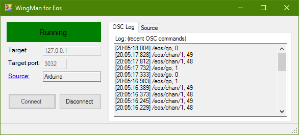
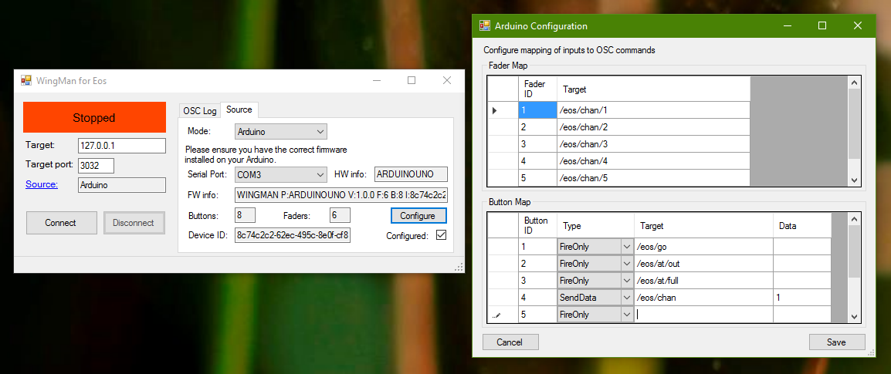

# Welcome
This is a tool I have built as a poor uni student to allow me to control my laptop
running [ETC Nomad](https://www.etcconnect.com/Products/Consoles/Eos-Family/ETCnomad-ETCnomad-Puck/Overview.aspx)
with physical sliders and buttons.

Why build my own, well [~£1000](https://www.etcconnect.com/Products/Consoles/Eos-Family/Accessories/Universal-Fader-Wing/Features.aspx) seems a bit much for me.

# Installation
**Todo:** upload precompiled binaries and ClickOnce installer. Also add makefile.

# Prerequisites
This project is built using C# and .Net 4.5 with Windows Forms so you will most likely
need a Windows PC - I have Windows 10 x64 on mine, and it runs fine, your mileage may
vary. RAM and CPU usage is minimal - rarely peaking 25MB and a couple of % CPU on a
(throttled) i5-2520m when processing 16 faders and 32 buttons.

# Arduino support/setup
I have been testing on an Arduino Uno clone from SparkFun - the [RedBoard](https://www.sparkfun.com/products/12757)
however the aim is to be using an Arduino Mega at some stage to allow 16 faders (the Uno only has 6 analog ins)

You will also need to modify the firmware in the [Arduino Firmware](https://github.com/rphi/WingMan/tree/master/Arduino%20Firmware) folder to
match the number of inputs on your board.

## Firmware version string
There is a version string that is sent to the client to allow it to know the ID of the device (for persistent configuration storage in the ConfigLibrary object
and .json file), the number of fader bytes to expect and the number of buttons supported. This is requested by sending an ASCII 'U' to the
Arduino during the device detection stage after a serial port is selected on the source configuration tab.

An example is below:

    WINGMAN P:ARDUINOUNO V:0.0.1 F:16 B:32 I:7c74c2c2-62ec-495c-8e0f-cf8877be322f

| "WINGMAN" identifier | firmware version no | number of faders | number of buttons | UUID |

## Serial Data format
The Arduino sends a series of bytes to the client software in the following format:

| Fader 1 analog input value | Fader 2 value | Fader 3 value | ... | Buttons 1-8 binary values | Buttons 9-16 values | ... |

Note there is no identification for the bytes; when I started this I thought the serial connection could be the bottleneck so wanted
to make the communication protocol as simple as possible. Therefore the order of the bytes is *crucial*.

What about a number of buttons that isn't a multiple of 8? It *should* just take the most significant bits from the last byte, but
I haven't tested that yet.

# Use
Once you have a copy of the WingMan firmware flashed to your Arduino, you should be able to open the client,
go to the "Source" tab and click the "Mode" dropdown to select Arduino.

*Why do you have a dropdown for that?* Well, I have tried to make the OSC processing abstracted from the Arduino
communication (it's actually behind the `ISource` interface) so at some stage I could hopefully relatively
easily add support for a MIDI wing or something... who knows.

The software should search for COM ports and if it finds any, automatically poll the first one for an Arduino
running WingMan firmware. If you have multiple COM ports, ignore the error if it chooses the wrong one and 
just select the correct port from the dropdown. It should then communicate with the Arduino, grab its 
firmware version string and populate the fields with its capabilities. You now need to click the "Configure" 
button to set your OSC mappings.

Finally add the IP address of the target for OSC packets and the port then hit "Connect". Fingers crossed
you should start seeing items in the OSC log tab and also packets arriving at your target device!

## OSC mappings
In the configuration menu enter the addresses for the faders to send their data to. For buttons you can either have
a `FireOnly` button that sends a `1` to the address specified on key-down and a `0` on key-up or a `SendData` button
that sends the `int` in the Data field to the address specified.

Any blank mappings will be ignored when producing OSC packets. Hit "Save" and the new mappings will be loaded into the
running configuration and also written to the ConfigLibrary .json file in the executable's startup directory.
